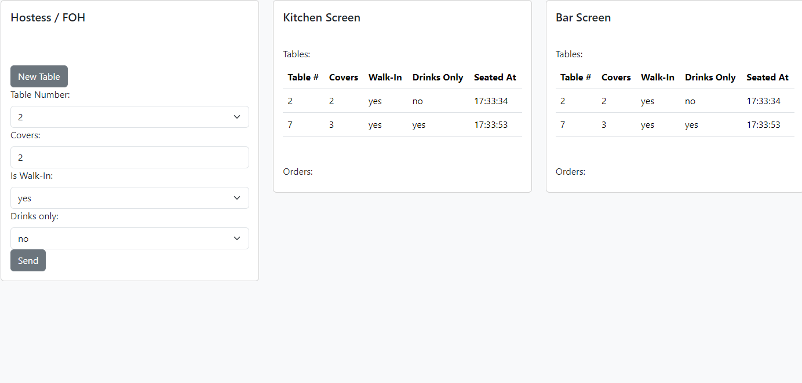

# signalR_messaging

To test signalR in postman you need '' this character at the end of the message for it to work.
To get Icon open up windows menu and press ALT + 0030

To test different messages in postman:

To set Protocol:
{ "protocol": "json", "version":1 }

Different type of messages:
{
    "target": "SendTableNotification",
    "arguments" : [{"tableNumber": 2, "covers": 5, "isWalkIn": false, "forDrinksOnly": true}],
    "type":1
}

{
    "target": "SendDrinkOrder",
    "arguments" : [{"tableNumber": 2, "items": ["water", "beer", "soda"]}],
    "type":1
}

{
    "target": "SendFoodOrder",
    "arguments" : [{"tableNumber": 2, "items": ["bread and cheese board", "side salad", "chips"]}],
    "type":1
}

React Front-End [in progress]

- Screen split into Hostess/FOH screen, Kitchen Screen & Bar Screen

FOH enters details of new seating in restaurant, table number, covers, if they are a bookings or walk-in and if for drinks only (kitchen can ignore) and sends via post API call.

Kitchen & Bar Screen displays a list of tables seated (NewTableNotifications received through signalR connection). Seated At timestamp comes from backend, time of api request. 

TODO: Order for bar and kitchen, input for foh and list in the correct screens.